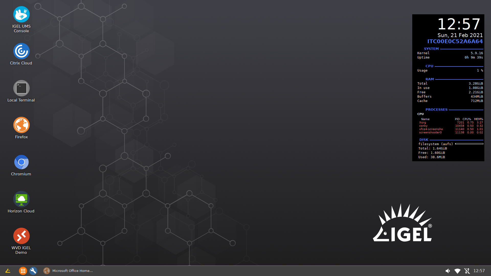

# Conky

|  CP Information |            |
|--------------------|------------|
| Package | [Conky](https://github.com/brndnmtthws/conky) - Current Version    Conky is a free, light-weight system monitor for X, that displays any kind of information on your desktop. |
| Script Name | [conky-cp-init-script.sh](conky-cp-init-script.sh) |
| CP Mount Path | /custom/conky |
| CP Size | 20M |
| IGEL OS Version (min) | 11.4.240 |
| Metadata File   conky.inf | [INFO]   [PART]   file="conky.tar.bz2"   version="1.10.8"   size="20M"   name="conky"   minfw="11.04.240" |
| Path to Executable | /custom/conky/usr/bin/conky |
| Path to Icon | N/A |
| Download package and missing libraries | apt-get download conky   apt-get download conky-std   apt-get download libgif7   apt-get download libid3tag0   apt-get download libimlib2   apt-get download liblua5.1-0 |
| Packaging Notes | Create folder: **conky**    dpkg -x <package/lib> custom/conky |
| Package automation | [build-conky-cp.sh](build-conky-cp.sh)    Tested with 1.10.8 |

