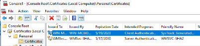
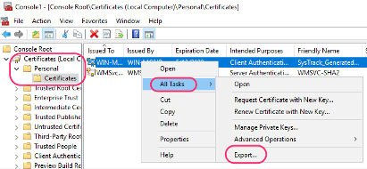
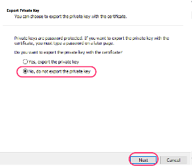
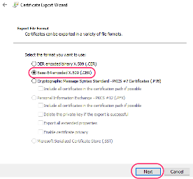
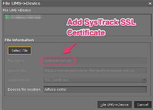

# Lakeside SysTrack Agent (13 December)

| CP Information        |                                                 |
| --------------------- | ------------------------------------------------|
| Package               | [Lakeside SysTrack Agenet](https://duckduckgo.com/?q=Lakeside+SysTrack+Linux+Agent+Installation+Guide) - SysTrack Linux agent includes endpoint data collection and integration with the SysTrack tool suite. |
| Script Name           | [systrack-cp-init-script.sh](build/systrack-cp-init-script.sh) |
| CP Mount Path         | /custom/systrack                                 |
| CP Size               | 100M                                            |
| IGEL OS Version (min) | 11.07.110                                       |
| Packaging Notes       | See build script for details                    |
| Package automation    | [build-systrack-cp.sh](build/build-systrack-cp.sh) |

-----

## Profile variable SYSTRACK_FQDN_SERVER

Edit Profile to set `SYSTRACK_FQDN_SERVER` to the SysTrack server name. The IGEL OS endpoint must be able to resolve and connect to the SysTrack server.

-----

## SysTrack SSL Preparation

The Linux child agent requires SSL (Secure Socket Layer) Certificate Verification in order to securely connect to the Master. This type of security protocol requires that a valid SSL certificate is installed on the Linux child system.

Export Certificate

Start > MMC

File > Add/Remove Snap-in… > Certificates > Computer account > OK

Deploy the SysTrack SSL certificate to the IGEL OS endpoints

**NOTE:** Copy this file to the Downloads folder on Ubuntu 18.04 builder. This file will be in the  Custom Partition (CP) /custom/systrack/tmp folder.
