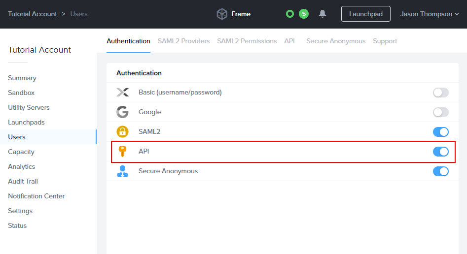
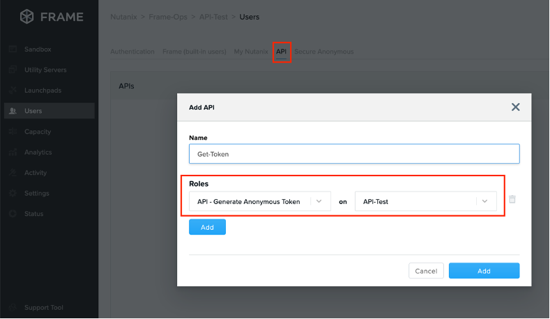
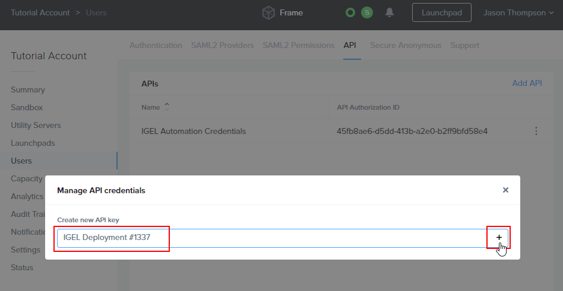
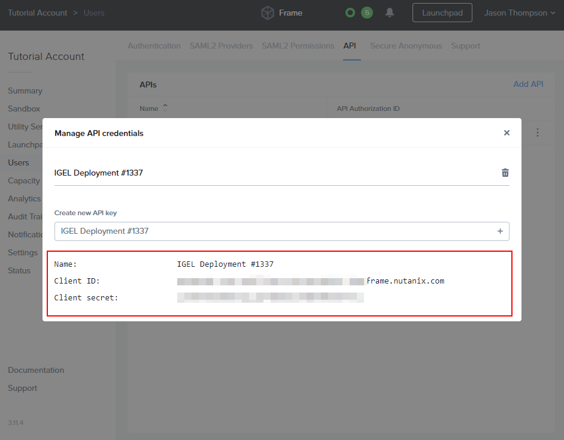
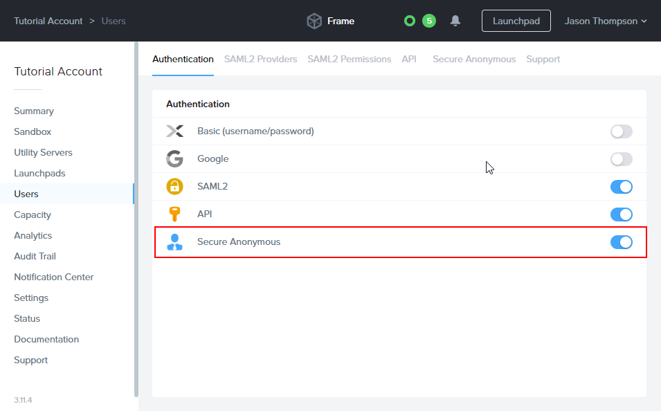
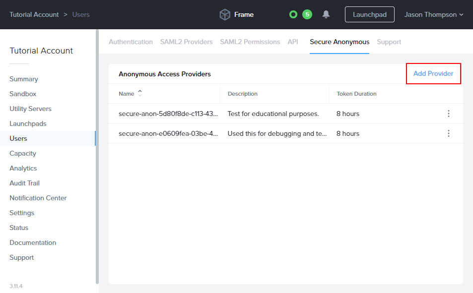
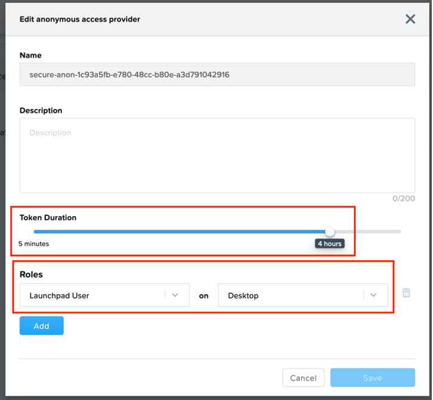
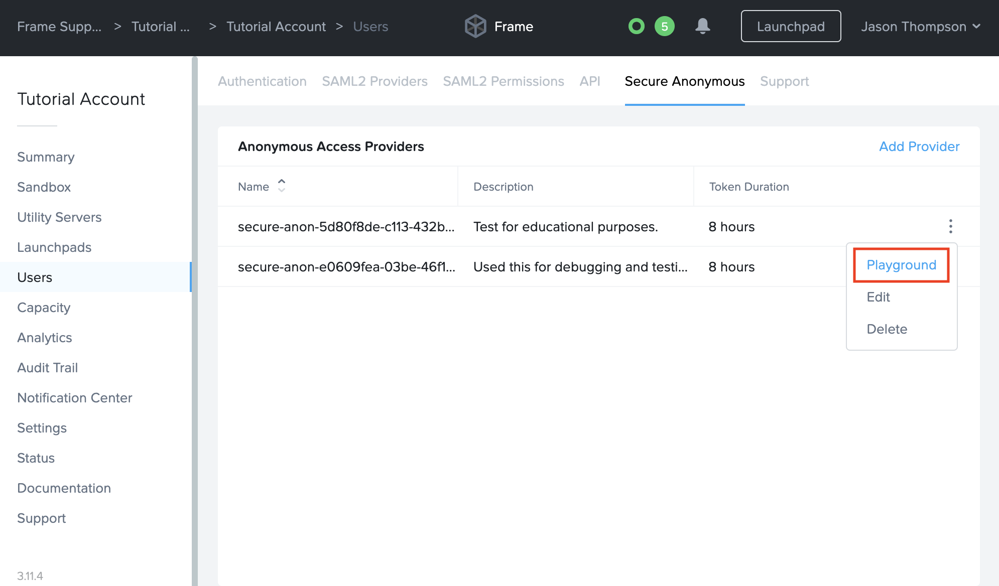

# Nutanix Frame (8 December)

| CP Information        |                                                                                                               |
| --------------------- | ------------------------------------------------------------------------------------------------------------- |
| Package               | Nutanix Frame - Current Version                                                                               |
| Script Name           | [frame-cp-init-script.sh](build/frame-cp-init-script.sh)                                                      |
| CP Mount Path         | /custom/frame                                                                                                 |
| CP Size               | 500M                                                                                                          |
| IGEL OS Version (min) | 11.05.133                                                                                                     |
| Download package      | Download Latest Frame App for Linux (Debian) <br /> https://portal.nutanix.com/page/downloads?product=xiframe |
| Packaging Notes       | See build script for details                                                                                  |
| Package automation    | [build-frame-cp.sh](build/build-frame-cp.sh)                                                                  |

-----

## Frame App IGEL Bundling instructions For Ubuntu 18.04
1. Download the latest [Frame App for Linux (Debian)](https://portal.nutanix.com/page/downloads?product=xiframe) to your `~/Downloads` directory.
2. Download and unzip `Nutanix_Frame.zip` from [https://github.com/IGEL-Community/IGEL-Custom-Partitions/raw/master/CP_Packages/Apps/Nutanix_Frame.zip](https://github.com/IGEL-Community/IGEL-Custom-Partitions/raw/master/CP_Packages/Apps/Nutanix_Frame.zip).
3. Using a terminal, navigate to the unzipped directory to `/target/build/` and execute `build-frame-cp.sh`
4. Copy `frame.ini` and `frame.tar.bz2` from `/target/` to the UMS RemoteManager server.
   1. Linux UMS host: `/opt/IGEL/RemoteManager/rmguiserver/webapps/ums_filetransfer/Frame/`
   2. Windows UMS host: `C:/Program Files/IGEL/RemoteManager/rmguiserver/webapps/ums_filetransfer/Frame/`
5. Import Frame's Custom Profile(s) from `/igel/*`
6. Edit the profile and
set up *Firmware Customization -> Custom Partition -> Download* with your UMS server info and credentials.
7. Setup env variables as instructed in the guides below.

**Frame IGEL Custom Profile guides**

- [Basic Frame App Profile](#basic-frame-app-profile)
- [Frame SAML2 Kiosk Mode Profile](#frame-saml2-kiosk-mode-profile)
- [Frame SAT Kiosk Mode Profile](#frame-sat-kiosk-mode-profile)

-----

# Frame App Releases
## Frame App 6.16

Published on 2022-12-08

Added:

General

- Ability for users to automatically enable sound, microphone, and webcam via Preferences.

- Ability to hide the [Frame Status Bar](https://docs.frame.nutanix.com/enduser/enduser-navaccount.html#status-bar) when in full-screen mode with Frame App. This feature can be enabled by setting the following Advanced Terminal Argument (either within Dashboard > Settings > Session > Advanced Options or Dashboard > Launchpads > Session Settings > Advanced Options).

- Advanced Terminal Argument: `hideStatusBarOnFullscreen`

Fixed:

General

- Issue where Frame App would automatically exit full-screen mode when session closed while in [kiosk mode](https://docs.frame.nutanix.com/session-conduct/frame-app/frame-app-config.html#frapp-args).

- Issue where users were able to exit full-screen mode while in [kiosk mode](https://docs.frame.nutanix.com/session-conduct/frame-app/frame-app-config.html#frapp-args).

- Additional reliability fixes.

-----

## Frame App 6.15

Published on 2022-11-10

Fixed:

General

- Reverted to CEF version 100.

- Issue where session performance degradation may occur in certain configurations.

Frame App for Linux

- Issue where resizing Frame App windows size may fail resulting in black border around windows contents.

- Additional reliability fixes.

-----

## Frame App 6.13.0

Published on 2022-09-15

Frame App 6.13.0

Added:

General

- New Help menu when starting Frame App via command line with --help argument. Displays all available command line arguments.

- Option for users to configure time (in seconds) in which Esc key must be pressed in order to exit full-screen mode (configurable via Preferences menu or command line).

Fixed:

General

- Issue where Frame App may crash unexpectedly resulting in a white screen. Also added ability for users to reload Frame App and return to Launchpad to resume their sessions in these situations.

Frame App for Linux

- Issue where Frame App application window may appear small upon start depending on screen resolution.

- Additional reliability fixes.

-----

## Frame App 6.12.0

Published on 2022-06-16

Frame App 6.12.0

Added:

General

- Support for locking mouse back/forward buttons while in session to prevent users from accidentally exiting the session.

- Support to enable/disable locking mouse back/forward buttons via command line argument (disable-mouse-lock).

Fixed:

General

- Users can now exit full screen and kiosk mode by pressing and holding Esc for 5 seconds (previously 10 seconds).

Frame App for Linux

- Issue where Windows key can become unresponsive in session.

- Issue where Ctrl, Alt, and Meta keys can become stuck in session.

- Issue where Linux error logs are not sent to Frame Platform.

- Changing application name from Frame Native Terminal to just Frame.

-----

## Frame App 6.11.1

Published on 2022-05-19

Frame App 6.11.1 (Hotfix)

This version is a hotfix to Frame App 6.11.0.

- Fixed issue with ```addEventListener``` function which could prevent USB devices (including HID) from functioning properly from within the Frame session in certain situations.

## Frame App 6.11.0

### Frame App 6.11

- Upgraded to Chromium 100
- Added support to clear cache on close of Frame App in addition to startup when **Clear user local cache** is enabled

### Frame App for Linux 6.11

-	Fixed issue where secondary displays would also show Frame Gear Icon/Menu
-	Fixed issue with keyboard shortcuts not working for shortcuts when **Windows** or **ALT** key is pressed first
-	Fixed issue when in full-screen mode, switching focus to another Linux app and back to Frame App would result in a blank screen
-	Fixed issue where after exiting full screen mode, Frame App menu bar shows up but there is no title bar or application window border and the Frame App window still takes up the full monitor without ability to resize.

-----

# Frame IGEL Custom Profiles

To get started, read each of the following profiles to see which sounds like the right fit for you and then import it into the IGEL UMS following the instructions below.

## Basic Frame App Profile
```js
import 'igel/frame-app-basic-profile.xml'
```

This Custom Profiles simply enables a Frame App icon on the IGEL Desktop. To launch Frame App with certain command line arguments, edit IGEL profile and append your command line argument(s) to the end of the command line.

Below is a table of [Linux command-line arguments for Frame App](https://docs.frame.nutanix.com/session-conduct/frame-app/frame-app-config.html#linux):

| Command Line Argument   | Description                                                                                                                                                                                                                                                    | Syntax                              |
| ----------------------- | -------------------------------------------------------------------------------------------------------------------------------------------------------------------------------------------------------------------------------------------------------------- | ----------------------------------- |
| `disable-mouse-lock`    | By default, Frame App will ignore mouse forward/back button events. If this argument is used, Frame App will respond to mouse forward/back button events. When a user is in session, these mouse events can cause the user to exit their session accidentally. | `./Frame --disable-mouse-lock`      |
| `displays-auto-arrange` | Frame App will launch with virtual displays configured to match your local environment.                                                                                                                                                                        | `./Frame --displays-auto-arrange`   |
| `kiosk`                 | Instructs Frame App to launch in full screen, a.k.a. “Kiosk mode.”                                                                                                                                                                                             | `./Frame --kiosk`                   |
| `url`                   | Designates the startup URL.                                                                                                                                                                                                                                    | `./Frame --url=console.nutanix.com` |
| `x11-window`            | Switch from GTK (default) to X11 Windows. This argument should be used with HP ThinPro OS clients.                                                                                                                                                             | `./Frame --x11-window`              |

---
## Frame SAML2 Kiosk Mode Profile

```js
import 'igel/frame-saml2-kiosk-profile.xml'
```

This profile is designed to support a specific end user workflow and assumes a particular Frame configuration.

### SAML2 Kiosk Mode User Experience

1. Frame App's cache is wiped to ensure a fresh session and authentication.
2. Frame App is launched in Kiosk Mode with multiple monitor support, presenting a third-party identity provider's login screen.
3. After logging in, end users will be taken by Frame App directly to the desktop or application (depends on the Launch Link configuration).
4. When a Frame session starts, the remote desktop will be in full-screen mode.
5. When end users disconnects by action or inactivity timeout, they'll see an option to resume their session for the duration of the account/Launchpad's configured idle timeout.
6. When a user quits the session or shuts down windows, they'll be logged out and redirected to the identity provider's initial login page.
7. If Frame App is closed, user can start a new session by launching Frame App with the Frame icon on the IGEL Desktop.

### SAML2 + Kiosk mode requirements:

1. A *Published* Launchpad.
2. Configured identity provider with associated roles/permissions allowing access to the desired Frame Account.
3. Frame Launch Link with additional "Quit and log out" url parameter`&qlo=1`.
4. *Optional:* The Frame account production workload VMs can be joined to a Windows domain, if desired.

5. **Edit your IGEL UMS Custom Profile and go to**:
   > System > Firmware Customization > Environment Variables > Predefined

6. Paste your Launch Link:

     - `FRAME_LAUNCH_URL` - obtained from an Account's *Dashboard > Launchpad > Advanced Integrations* to get a configurable dialog with Launch Links. While we recommend Launch Links for Kiosk scenarios, the value of FRAME_LAUNCH_URL could instead be a standard Launchpad URL.

---

## Frame SAT Kiosk Mode Profile
```js
import 'igel/frame-sat-kiosk-profile.xml'
```

The Frame SAT Kiosk Custom Profile is designed to support a specific end user workflow relying on Frame's SATs or [Secure Anonymous Tokens](https://docs.frame.nutanix.com/frame-apis/sat-api.html) for identity; this flow also assumes a particular Frame configuration to support the kiosk experience as defined below.

### SAT Kiosk Mode User Experience:

1. End users will not authenticate to a SAML2-based identity provider (this script uses the Frame Secure Anonymous Token (SAT) functionality for session authentication).
2. User cache is removed prior to start of Frame App to ensure no user preference settings have persisted since the prior use of Frame App.
3. Frame App will launch in "kiosk mode" (full screen).
4. End users will be taken by Frame App directly to the desktop or application (depends on the [Launch Link](https://docs.frame.nutanix.com/session-conduct/advanced-integrations.html#launch-links) configuration).
5. When a Frame session starts, the remote desktop will be in full-screen mode.
6. When end users disconnect or close their session, Frame App will be restarted with a new SAT token. Disconnect behavior configurable with Frame Session Settings.

### SAT + Kiosk configuration requirements:

1. A *Published* Launchpad.
2. API Provider configured at the Organization entity.
3. Secure Anonymous Token Provider at the Account entity granting a role of Launchpad User for a specific Launchpad in a Frame account (under the Organization entity).
4. Frame [Launch Link](https://docs.frame.nutanix.com/session-conduct/advanced-integrations.html#launch-links) is used, rather than a Launchpad URL to support automatic start of the user's session and to simplify the UX.
5. *Optional:* The Frame account production workload VMs can be joined to a Windows domain, if desired.


### Required Environment Variables

The following environment variables must be configured in the IGEL Custom Profile for this profile to work.

1. **Edit your IGEL UMS Custom Profile and go to**:
   > System > Firmware Customization > Environment Variables > Predefined

2. **Set the following environment variables:**
   - `FRAME_CLIENT_ID` - obtained from the API provider when a set of API credentials are created.
   - `FRAME_CLIENT_SECRET` - obtained from the API provider when a set of API credentials are created.
   -
      `FRAME_SAT_URL` - URL obtainable from the Playground.

      For example: `https://api.console.nutanix.com/v1/accounts/XXXXXXXX-XXXX-XXXX-XXXX-31d09e2881cd/secure-anonymous/secure-anon-XXXXXXXX-XXXX-XXXX-XXXX-c5e2dc93df1e/tokens`.
   - `FRAME_ACCOUNT_ID` - Sign in to [Nutanix Console](https://console.nutanix.com) as an Admin. Locate your account, click the three-dot menu, and select "update" to view the Account's entity settings. Next, copy the Account UUID from the browser's URL bar. For example: `https://console.nutanix.com/frame/account/YOUR-FRAME-ACCOUNT-UUID-HERE/basic-info`
   - `FRAME_EMAIL_DOMAIN` - email domain name used to create the anonymous user email addresses that will be visible in the Session Trail.
   - `FRAME_LAUNCH_URL` - obtained from an Account's *Dashboard > Launchpad > Advanced Integrations* to get a configurable dialog with Launch Links. While we recommend Launch Links for Kiosk scenarios, the value of FRAME_LAUNCH_URL could instead be a standard Launchpad URL.
   - `FRAME_TERMINAL_CONFIG_ID` - obtainable from the Launch Link URL.

---

## Frame Admin API and SAT quick setup guide

1. Enable API access

   > Account > Users > Authentication

   

2. Add an API

   > Account > Users > API

   Create an API with with the ability to generate anonymous tokens an account or organization.

   

3. Create a set of credentials for use with the Custom Profile.
   <figure>

   
   <figcaption>Manage Credentials</figcaption>
   </figure>

   <figure>

   
   <figcaption>Create new API key</figcaption>
   </figure>

   <figure>

   
   <figcaption>Copy the credentials for use in the IGEL Environment Variables. Keep it secret; keep it safe.</figcaption>
   </figure>

## Secure Anonymous Access Setup

### 1. Enable "Secure Anonymous" access

  > Account > Users > Authentication

  

### 2. Create Anonymous Access Provider

  > Account > Users > Secure Anonymous

  

### 3. Add the Launchpad User role to the Provider



**Note:** If Launchpad User Role is not visible on the list, be sure you've created a launchpad first. If you have, refresh the page and try again.

### 4. Copy Provide URL from Playground Examples




-----

## Additional Frame Profile Customizations

In order to hide taskbar and disable any user interaction with IGEL OS, following options must be enabled inside profile:

- User Interface - Desktop - Taskbar - Uncheck ‘Use Taskbar’
- User Interface - Desktop - Start Menu - Uncheck all options
