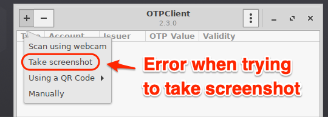
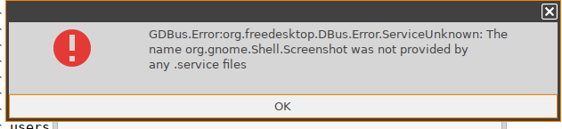

# OTPClient

|  CP Information |            |
|--------------------|------------|
| Package | OTPClient 2.3.0 <br /><br /> OTPClient is a highly secure and easy to use GTK+ 2FA tool that supports both time-based one-time Passwords (TOTP) and HMAC-based one-time passwords (HOTP). Other features include: <br /><br /> - Custom digits (between 4 and 10 inclusive) <br /> - Custom period for codes to be valid (between 10 and 120 seconds inclusive) <br /> - Supports SHA1, SHA256 and SHA512 algorithms <br /> - Supports steam codes <br /> - Import encrypted Authenticator Plus backup <br /> - Import and export encrypted and/or plain andOTP backup <br /> - Encrypted local database is encrypted using AES256-GCM |
| Script Name | [otpclient-cp-init-script.sh](otpclient-cp-init-script.sh) |
| CP Mount Path | /custom/otpclient |
| CP Size | 10M |
| IGEL OS Version (min) | 11.3.110 |
| Metadata File <br /> otpclient.inf | [INFO] <br /> [PART] <br /> file="otpclient.tar.bz2" <br /> version="2.3.0" <br /> size="10M" <br /> minfw="11.03.110" |
| Path to Executable | /custom/otpclient/usr/bin/otpclient |
| Path to Icon | /custom/otpclient/usr/share/icons/hicolor/256x256/apps/com.github.paolostivanin.OTPClient.png |
| Add respository | sudo add-apt-repository ppa:dawidd0811/otpclient <br /> sudo apt-get update |
| Download package and missing libraries | apt-get download otpclient <br /> apt-get download libcotp12 <br /> apt-get download libzbar0 <br /> apt-get download libzip4 <br /> apt-get download libbaseencode1 |
| Packaging Notes | Create folder: **otpclient** <br /> <br /> dpkg -x <package/lib> otpclient <br /><br /> Need to move the mime folder: <br /><br />mv /custom/otpclient/usr/share/applications /custom/otpclient/usr/share/applications.mime <br /><br />The init script needs additional files to configure AppArmor: <br /><br /> /custom/otpclient/config/bin/[otpclient_cp_apparmor_reload](otpclient_cp_apparmor_reload) <br /> /custom/otpclient/lib/systemd/system/[igel-otpclient-cp-apparmor-reload.service](igel-otpclient-cp-apparmor-reload.service) |
| Package automation | [build-otpclient-cp.sh](build-otpclient-cp.sh) <br /><br /> This script will attempt to automate the downloads and build of otpclient.tar.bz2 |

-----
## Outstanding Issues

### 1 - Error trying to take screenshot




### 2 - Saving configuration and database files after reboot

The [otpclient-cp-init-script.sh](otpclient-cp-init-script.sh) creates the OTPClient configuration file /userhome/.config/otpclient.cfg with the following contents:

```{config file}
[config]
column_id=0
sort_order=0
window_width=500
window_height=300
db_path=/userhome/otpclient/NewDatabase.enc
  ```
The database file has to be called **NewDatabase.enc** and must reside in **/userhome/otpclient** folder.
