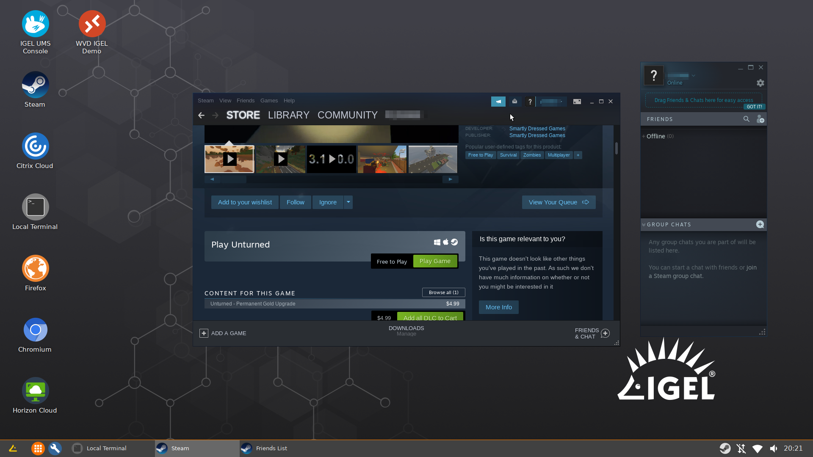

# Steam (DRAFT Package for Testing)

|  CP Information |            |
|--------------------|------------|
| Package | Steam - [Current Version](https://store.steampowered.com/about)
| Script Name | [steam-cp-init-script.sh](steam-cp-init-script.sh) |
| CP Mount Path | /custom/steam |
| CP Size | 3000M |
| IGEL OS Version (min) | 11.04.240 |
| Metadata File   steam.inf | [INFO]   [PART]   file="steam.tar.bz2"   version="1.0.0.68"   size="3000M"   name="steam"   minfw="11.04.240" |
| Path to Executable | /custom/steam/usr/bin/steam |
| Path to Icon | /custom/steam/usr/share/icons/hicolor/256x256/apps/steam.png |
| Missing Libraries | See build script for details |
| Download package and missing library | See build script for details |
| Packaging Notes | Create folder: **steam**    dpkg -x <package/lib> custom/steam |
| Package automation | [build-steam-cp.sh](build-steam-cp.sh)    Tested with 1.0.0.68 |

**NOTE:** Games are large and an external disk may be needed.

