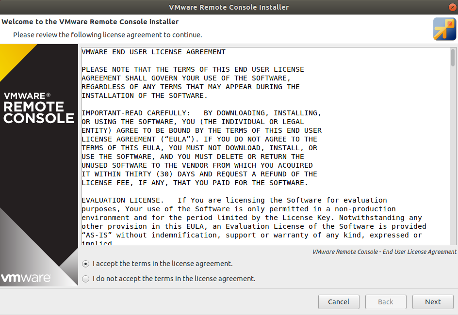
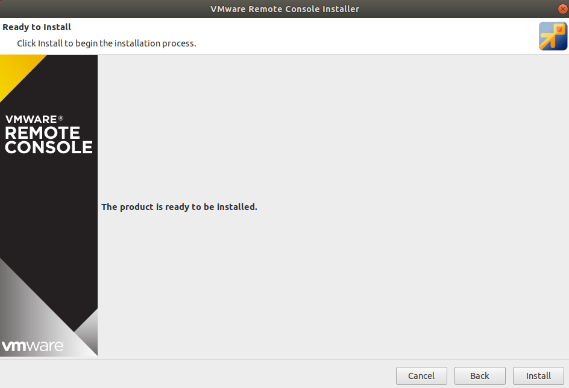

# VMware Remote Console (VMRC) (DRAFT Package for Testing)

|  CP Information |            |
|--------------------|------------|
| Package | [VMware Remote Console - vmrc](https://docs.vmware.com/en/VMware-Remote-Console/index.html)    VMware Remote Console provides client device connection and console access to virtual machines on a remote host. |
| Script Name | [vmrc-cp-init-script.sh](vmrc-cp-init-script.sh) |
| CP Mount Path | /custom/vmrc |
| CP Size | 300M |
| IGEL OS Version (min) | 11.04.240 |
| Metadata File   vmrc.inf | [INFO]   [PART]   file="vmrc.tar.bz2"   version="12.0.0"   size="300M"   name="vmrc"   minfw="11.04.240" |
| Path to Executable | /custom/vmrc/usr/bin/vmrc |
| Path to Icon | /custom/vmrc/usr/share/icons/hicolor/48x48/apps/vmware-vmrc.png |
| Packing Notes | See build script for details |
| Package automation | [build-vmrc-cp.sh](build-vmrc-cp.sh)    Tested with 12.0.0 |

**VMware Remote Console -- Install screenshots**

