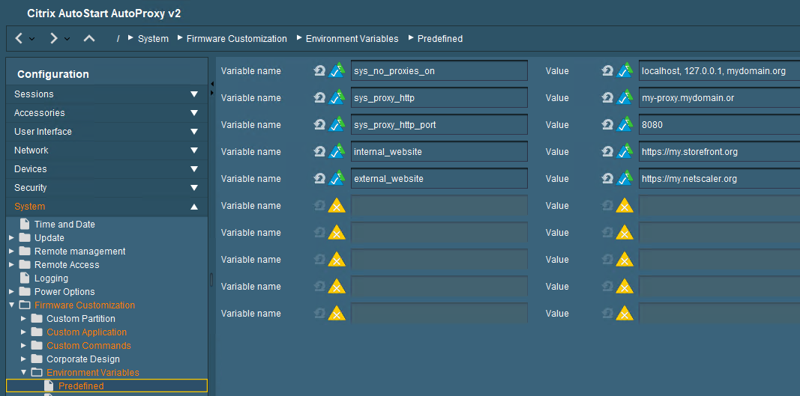

# Citrix AutoStart AutoProxy

|  CP Information | **NOTE:** This is not a CP. It is a profile with an embedded script.            |
|--------------------|------------|
| Package | citrix-autostart-autoproxy V2 |
| IGEL OS Version (min) | 11.8.230 |
| Notes | Citrix Auto Start on NetScaler (external) or Storefront (internal) with Proxy Settings and Browser.    **Note:** Update the profile with values for the variables.    Also tested with WebEx VDI and Zoom VDI with Proxy. |
| [Citrix-AutoStart-AutoProxy-v2](igel/Citrix-AutoStart-AutoProxy-v2.xml) | Version 2 |

-----

