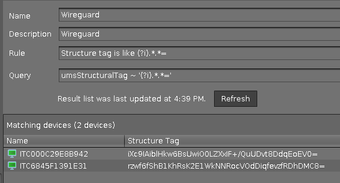

# WireGuard (28 September)

|  CP Information | **NOTE:** This is not a CP. It is a profile with an embedded script.            |
|--------------------|------------|
| Package | [WireGuard VPN](https://www.wireguard.com/) <br /><br /> WireGuard VPN requires the exchange of public keys. This profile will copy the public key from the endpoint to UMS and store it in the **ums_structure_tag**. |

This profile creates the following files in the **/wfs/wireguard** folder:

- igel_wg_setup.sh (Main script)
- wg_clients.csv (Mapping for IGEL clients to WireGuard defined addresses)
- wg0.conf (Template file)

The **igel_wg_setup.sh** script will create the client's public / private keys, send the client's public key to the UMS (ums_structure_tag), update wg0.conf template file, copy these files to **/etc/wireguard**, and start WireGuard.

**NOTE:** Two reboots are needed after this profile is assigned.

-----

## Profile Environment Variables > Predefined

This profile has the following environment variables and is based on the following document: [Automate WireGuard installation on Linux with Bash Script](https://techviewleo.com/automate-wireguard-installation-on-linux/)

- WG_PUBLIC_ADDRESS
- WG_PUBLIC_IPV4
- WG_PUBLIC_IPV6
- WG_PORT
- WG_DNS1
- WG_DNS2
- WG_PUBLIC_KEY
- WG_PRESHARE_KEY

Update the values for these environment variables based on the settings in your WireGuard server.

-----

## UMS Structure Tag holds WireGuard client public key

```bash
setparm system.remotemanager.ums_structure_tag CLIENT_PUBLIC_KEY
write_rmsettings
get system.remotemanager.ums_structure_tag CLIENT_PUBLIC_KEY
```

In the UMS, a view can be created to show the mapping of client machines to their WireGuard public key. This view can be exported to a file and added to the WireGuard server.

UMS View


```bash
Name: WireGuard
Description: Wireguard
Rule: Structure tag is like (?i).*.*=
Query: umsStructuralTag ~ '(?i).*.*='
```

-----

## Mapping of IGEL clients to WireGuard defined addreses

Edit the profile (**System > Firmware Customization > Custom Commands > Network > Final Network Command**) to contain the mapping of clients to WireGuard IPs.

```bash
cat << 'EOF' > /wfs/wireguard/wg_clients.csv
ITC6845F1391E31,10.66.66.4/32
ITC0800270F8F75,10.66.66.5/32
ITC000C29A1EAF6,10.66.66.6/32
ITC000C29E8B942,10.66.66.7/32
EOF
```
