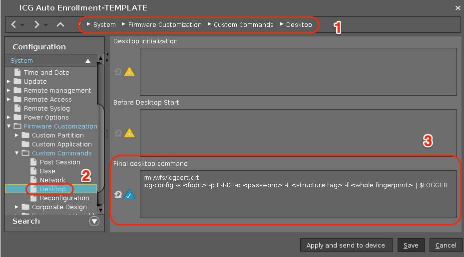

# ICG Auto Enrollment

|  CP Information | **NOTE:** This is not a CP. It is a profile with an embedded command.            |
|--------------------|------------|
| Package | icg-auto-enrollment 1.01 |
| IGEL OS Version (min) | 11.01.100 |
| Notes | Profile to pre-setup IGEL OS (such as UDPockets) devices before deliverying them to users. <br /><br /> Steps to use:<br /> - Register the device(s) with the UMS<br /> - Apply this profile to configure connectivity to an ICG<br /><br /> Items to update in profile:<br /> -s \<fqdn\> -- ICG Server Name<br /> -p 8443 -- Communication Port<br /> -o \<password\> -- One Time Password<br /> -t \<structure tag\> -- UMS structure tag<br /> -f \<whole fingerprint\> -- Root certificate fingerprint |

ICG Command:
```{icg command}
rm /wfs/icgcert.crt
icg-config -s <fqdn> -p 8443 -o <password> -t <structure tag> -f <whole fingerprint> | $LOGGER
  ```


