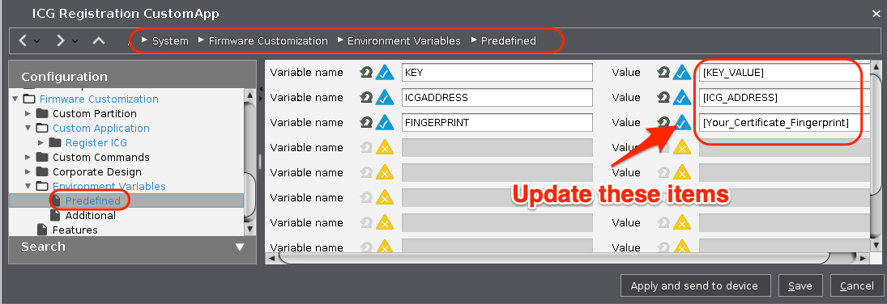

# ICG (IGEL Cloud Gateway) Register (9 February Update)

|  CP Information | **NOTE:** This is not a CP. It is a profile with an embedded command.            |
|--------------------|------------|
| Package | ICG-Register 1.01 |
| IGEL OS Version (min) | 11.04.240 |
| Notes | Profile with custom application with predined variables that allow a user, with one click on icon on desktop, to register with IGEL ICG.  <br /><br /> Update variables in profile (System > Firmware Customization > Environment Variables > Predefined):  KEY, ICGADDRESS, FINGERPRINT <br /><br /> Assign profile to devices |

## ICG Command (Version 01):
```{icg command}
/sbin/icg-config -s $ICGADDRESS -o $KEY -f $FINGERPRINT;\
zenity --warning --text="The Device was registered to the IGEL Cloud Gateway (ICG) and will be restarted now." --ellipsize;\
reboot
  ```

## ICG Command (Version 02):
```{icg command}
pkexec --user root /sbin/icg-config -s $ICGADDRESS -o $KEY -f $FINGERPRINT;\
zenity --warning --text="The Device was registered to the IGEL Cloud Gateway and will be restarted now." --ellipsize;\
reboot
  ```




