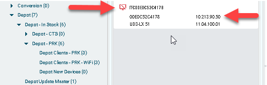
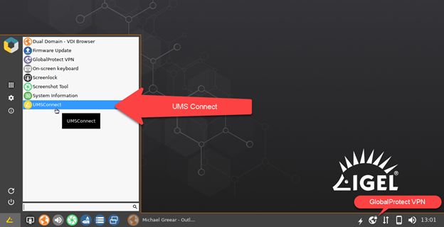
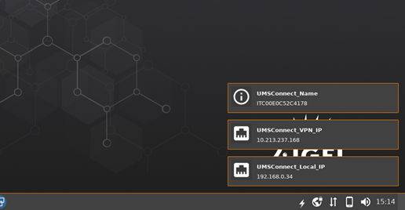
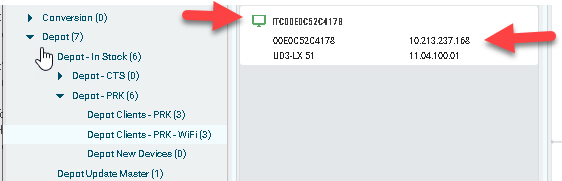

# UMS Connect

|  CP Information | **NOTE:** This is not a CP. It is a profile with an embedded command.            |
|--------------------|------------|
| Package | ums-connect 1.02 |
| IGEL OS Version (min) | 11.07.100 |
| Notes | UMSConnect is an IGEL OS 11 custom application that connects to UMS after changing IP addresses on the endpoint. This may happen due to a network issue, a VPN connection, or other event. After the IP changes, in some situations, you cannot reconnect to UMS. When your connection is lost, do not fear! You do not need to reboot, rediscover, or do anything except click on “UMS Connect”. |

-----
### Here you see the device that has the changed IP address and is now unmanageable in UMS:



### In this case, the device was switched to a vpn connection, but do not worry – just click on “UMS Connect”!



### Now you will see all network connections onscreen. If it had switched to WiFi you would also see the current WiFi connection information here:



### Now the device is showing online and manageable in UMS:



-----

**/bin/igel_umsconnect.sh**

```bash
#!/bin/bash
###########################################################################################
# Script Name umsconnect for IGEL OS 11.07.100
# Written by Michael Greear 09/2020 edited for 11.06.1 01/22/2022
# Version 3.0.2
###########################################################################################
pkexec --user root get_rmsettings
pkexec --user root killwait_postsetupd

# determine interfaces
# https://kb.igel.com/igelos-11.08.200/en/lan-interfaces-69178031.html
if [ -e /config/net/en-interfaces ]; then
  LOCAL_IP=$(head -n 1 /config/net/en-interfaces)
else
  LOCAL_IP=eth0
fi
if [ -e /config/net/wl-interfaces ]; then
  WIFI_IP=$(head -n 1 /config/net/wl-interfaces)
else
  WIFI_IP=wlan0
fi
notify-send-message -t 200000 -i /usr/share/icons/IGEL-Basic/categories/64/igel-network.png UMSConnect_Local_IP $(ip -o -4 addr show dev ${LOCAL_IP} | cut -d' ' -f7 | cut -d'/' -f1)
notify-send-message -t 200000 -i /usr/share/icons/IGEL-Basic/categories/64/igel-network.png UMSConnect_WiFi_IP $(ip -o -4 addr show dev ${WIFI_IP} | cut -d' ' -f7 | cut -d'/' -f1)
notify-send-message -t 200000 -i /usr/share/icons/IGEL-Basic/categories/64/igel-network.png UMSConnect_VPN_IP $(ip -o -4 addr show dev tun0 | cut -d' ' -f7 | cut -d'/' -f1)
notify-send-message -t 200000 -i /usr/share/icons/IGEL-Basic/categories/64/igel-info.png UMSConnect_Name $(hostname -a)
  ```
