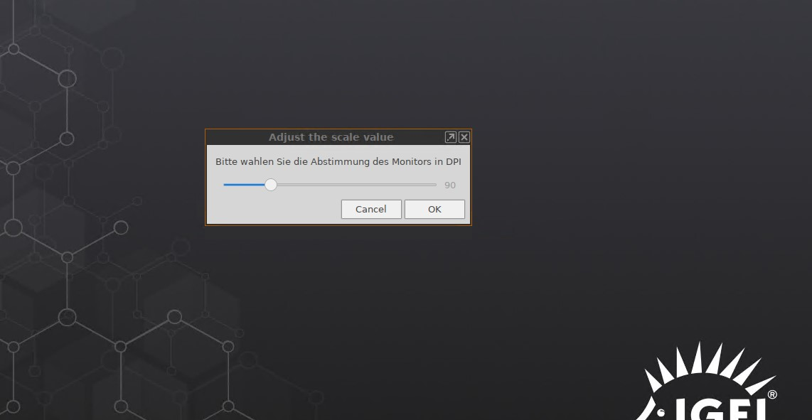

# Adjust Display DPI Scale

|  CP Information | **NOTE:** This is not a CP. It is a profile with an embedded command.            |
|--------------------|------------|
| Package | adjust-display-dpi-scale 1.01 |
| IGEL OS Version (min) | 11.3.110 |
| Notes | Profile to adjust the display DPI scale without root rights and without giving the user the rights to configure the full display. <br /><br /> Profiles created for German and English. <br /><br /> ***Note:*** This can be used synchronize the DPI scale in VMware Horizon. |

```{german version}
german version:
setparam x.xserver0.auto_dpi off && setparam x.xserver0.dpi $(zenity --scale --min-value=30 --max-value=300 --step=5 --text="Bitte wahlen Sie die Abstimmung des Monitors in DPI" --value=90) && /usr/bin/wmrefresh
  ```


```{english version}
english version:
setparam x.xserver0.auto_dpi off && setparam x.xserver0.dpi $(zenity --scale --min-value=30 --max-value=300 --step=5 --text="Please choose the DPI scale" --value=90) && /usr/bin/wmrefresh
  ```

