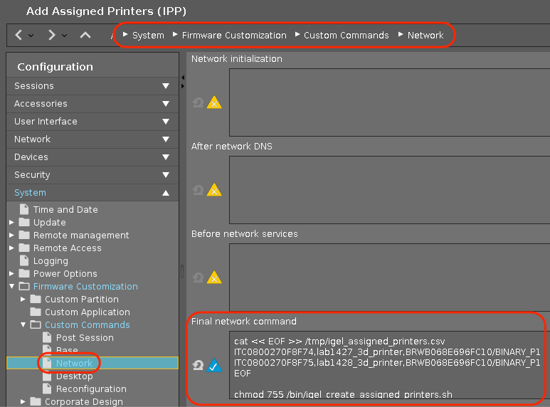
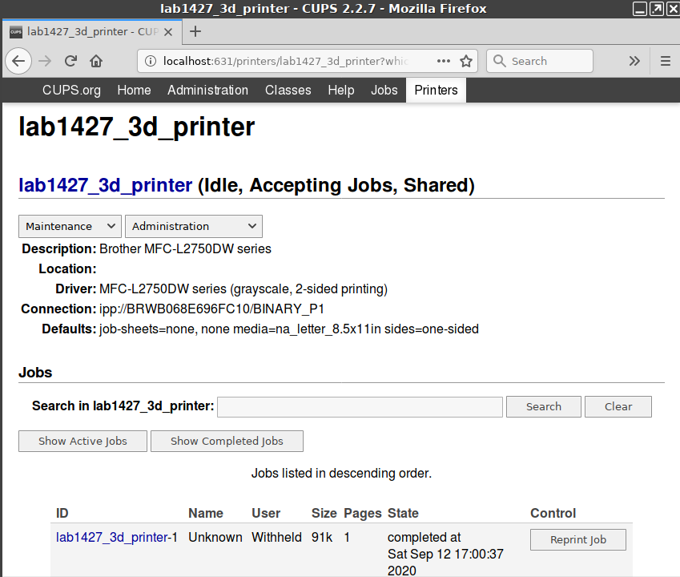

# Work from Office: Add assigned printers


|  CP Information | **NOTE:** This is not a CP. It is a profile with an embedded script.            |
|--------------------|------------|
| Package | wfo-add-assigned-printers 1.02 |
| Script Name | /bin/igel_create_assigned_printers.sh |
| Assigned Printers | /tmp/igel_assigned_printers.csv <br /><br /> **Note:** This file is created from the embedded script.|
| Format of Assigned Printers CSV | hostname,print-spooler-name,IPP-Name,default <br /> hostname,print-spooler-name,IPP-Name,notdefault |
| IGEL OS Version (min) | 11.3.110 |
| Notes | Sample proof of concept to add assigned printers from embedded script created /tmp/igel_assigned_printers.csv file. <br /><br /> Limited error checking – Just to show the art of the possible… <br /><br /> Profile (requires a reboot once profile is applied) that will assign defined printers and configure them with CUPS IPP driver.<br /><br /> See -- https://www.cups.org/doc/admin.html#MODELS |
| [Add-Assigned-Printers-IPP-profile-v2-Citrix.xml](Add-Assigned-Printers-IPP-profile-v2-Citrix.xml) | Version 2 Citrix adds the printers to Citrix wfclient.ini (ClientPrinterList) as noted [here](https://docs.citrix.com/en-us/citrix-workspace-app-for-linux/configure-xenapp.html). |

Profile needs to be updated with a mapping of hosts to printers. /usr/lib/cups/backend/snmp should be used to collect the IPP URI.

Here is output from /usr/lib/cups/backend/snmp for my network printer (Brother MFC-L2750DW)

 ```{snmp}
/usr/lib/cups/backend/snmp
  ```

network lpd://BRWB068E696FC10/BINARY_P1 "Brother MFC-L2750DW series" "Brother MFC-L2750DW series" "MFG:Brother;CMD:PJL,PCL,PCLXL,URF;MDL:MFC-L2750DW series;CLS:PRINTER;CID:Brother Laser Type1;URF:W8,CP1,IS4-1,MT1-3-4-5-8,OB10,PQ3-4-5,RS300-600-1200,V1.4,DM1;" “"

Command to add above printer:

```{command}
lpadmin -p wifiprinter1 -E -v ipp://BRWB068E696FC10/BINARY_P1 -m everywhere && lpoptions -d wifiprinter1
  ```

***
Printing with CUPS and IPP (Internet Printing Protocol) allows for finding and printing to networked and USB printers without using vendor specific software.

https://www.pwg.org/ipp/everywhere.html

CUPS has printing APIs to allow applications to easily provide options via IPP. Most printers sold since 2010 support IPP printing with standard file formats and can be used without printer drivers or PPD files.

https://www.cups.org/blog/2018-06-06-demystifying-cups-development.html

***
**Citrix Notes**

https://docs.citrix.com/en-us/citrix-virtual-apps-desktops/printing.html

https://docs.citrix.com/en-us/citrix-virtual-apps-desktops/printing/printing-configuration-example.html

https://docs.citrix.com/en-us/citrix-workspace-app-for-linux/configure-xenapp.html

Use of the Citrix Universal printer driver ensures that all printers connected to a client can also be used from a virtual desktop or application session without integrating a new printer driver in the data center.

**Auto-created client printers and Citrix Universal printer driver**

For home offices where users work on non-standard workstations and use non-managed print devices, the simplest approach is to use auto-created client printers and the Universal printer driver.

**Deployment summary**

In summary, the sample deployment is configured as follows:

* No printer drivers are installed on Multi-session OS machines. Only the Citrix Universal printer driver is used. Fallback to native printing and the automatic installation of printer drivers are disabled.

**Auto-create client printers**

This setting specifies the client printers that are auto-created. This setting overrides default client printer auto-creation settings.

By default, all client printers are auto-created.

This setting takes effect only if the Client printer redirection setting is present and set to Allowed.

When adding this setting to a policy, select an option:

* Auto-create all client printers automatically creates all printers on a user device.
* Auto-create the client’s default printer only automatically creates only the printer selected as the default printer on the user device.

***
IGEL Profile: System > Firmware Customization > Custom Commands > Network > Final network command


CUPS Web Interface (IGEL OS): lab1427_3d_printer

