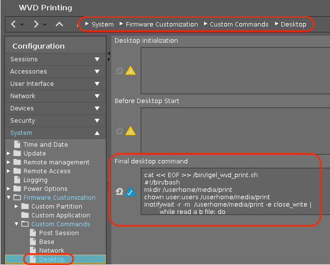

# Microsoft WVD: Enable printing for WVD in IGEL OS – workaround


|  CP Information | **NOTE:** This is not a CP. It is a profile with an embedded script.            |
|--------------------|------------|
| Package | wvd-printing 1.01 |
| Script Name | /bin/igel_wvd_print.sh |
| IGEL OS Version (min) | 11.3.580 |
| Notes | Sample proof of concept based on the following blog post by Fredrik Brattstig: <br /><br /> [Enable printing for WVD in IGEL OS - workaround](https://virtualbrat.com/2020/06/11/howto-enable-printing-for-wvd-in-igel-os-workaround/) <br /><br />This assumes that printers are already setup on IGEL OS endpoint. <br /><br />**TIP:** Use one of the following methods to automatically setup printers: <br /><br />[WFH-Add-Network-Printers](https://github.com/IGEL-Community/IGEL-Custom-Partitions/tree/master/CP_Source/Tools_Drivers/WFH-Add-Network-Printers) or [WFO-Add-Assigned-Printers](https://github.com/IGEL-Community/IGEL-Custom-Partitions/tree/master/CP_Source/Tools_Drivers/WFO-Add-Assigned-Printers).|

File ```/bin/igel_wvd_print.sh``` created from profile:

```{code created in profile}
#!/bin/bash
mkdir /userhome/media/print
chown user:users /userhome/media/print
inotifywait -r -m  /userhome/media/print -e close_write |
        while read a b file; do
        [[ $b == *CLOSE_WRITE* ]] && lpr /userhome/media/print/"$file" && sleep 9 && rm /userhome/media/print/"$file"
        done
  ```

Any file copied into ```/userhome/media/print``` will be sent to default printer.

IGEL Profile: System > Firmware Customization > Custom Commands > Desktop > Final desktop command

