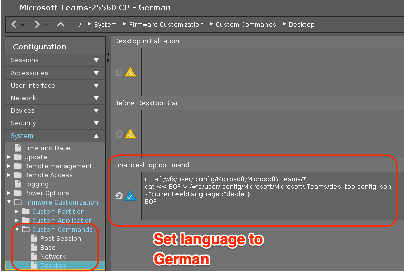

# Microsoft Teams

|  CP Information |            |
|--------------------|------------|
| Package | Microsoft Teams - Current Version |
| Script Name | [teams-cp-init-script.sh](teams-cp-init-script.sh) |
| CP Mount Path | /custom/teams |
| CP Size | 300M |
| IGEL OS Version (min) | 11.3.110 |
| Metadata File <br /> teams.inf | [INFO] <br /> [PART] <br /> file="teams.tar.bz2" <br /> version="1.3.00.30857" <br /> size="300M" <br /> name="teams" <br /> minfw="11.03.110" |
| Path to Executable | /custom/teams/usr/bin/teams [--proxy-server=http://proxy-host:proxy-port]|
| Path to Icon | /custom/teams/usr/share/pixmaps/teams.png |
| Missing Libraries | [libgnome-keyring.so.0](https://packages.ubuntu.com/bionic/libgnome-keyring0) |
| Download package and missing library | apt-get download teams <br /> apt-get download libgnome-keyring0 |
| Packaging Notes | Create folder: **teams** <br /><br /> dpkg -x <package/lib> custom/teams <br /><br /> Need to move the mime folder: <br /><br />mv /custom/teams/usr/share/applications /custom/teams/usr/share/applications.mime <br /><br />The init script needs additional files to configure AppArmor: <br /><br /> /custom/teams/config/bin/[teams_cp_apparmor_reload](teams_cp_apparmor_reload) <br /> /custom/teams/lib/systemd/system/[igel-teams-cp-apparmor-reload.service](igel-teams-cp-apparmor-reload.service) |
| Package automation | [build-teams-cp.sh](build-teams-cp.sh) <br /><br /> Tested with 1.3.00.25560, 1.3.00.30857 |

**NOTES:**

To use Teams over a proxy server append the following to Path to Executable:

```{use proxy server}
--proxy-server=http://proxy-host:proxy-port
  ```

If you want that a user has to log in into Teams after reboot place the following code in Desptop Final
rm -rf /wfs/user/.config/Microsoft
rm -rf /userhome/.config/Microsoft

| Customization | /wfs/user/.config/Microsoft/Microsoft Teams/desktop-config.json |
|---------------|----------------------- |
| English US | {currentWebLanguage":"en-us"} |
| German | {currentWebLanguage":"de-de"} |

Sample for setting German language (reboot required after CP deployed)


**Automation Notes:** [build-teams-cp.sh](build-teams-cp.sh)

Add respsitory:

```{add-respsitory}
sudo curl https://packages.microsoft.com/keys/microsoft.asc | sudo apt-key add -
echo "deb [arch=amd64] https://packages.microsoft.com/repos/ms-teams stable main" > /etc/apt/sources.list.d/teams.list
sudo apt-get update
   ```
