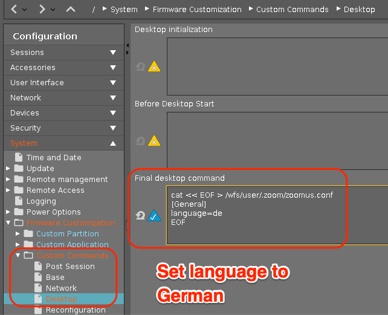

# Zoom (25 May - Updated)

|  CP Information |             |
|-----------------|-------------|
| Package | [Zoom - Current Version](https://support.zoom.us/hc/en-us/articles/205759689-New-Updates-for-Linux) |
| Script Name | [zoom-cp-init-script.sh](zoom-cp-init-script.sh) |
| CP Mount Path | /custom/zoom |
| CP Size | 400M |
| IGEL OS Version (min) | 11.4.240 |
| Metadata File   zoom.inf | [INFO]   [PART]   file="zoom.tar.bz2"   version="5.6.6"   size="400M"   minfw="11.04.240" |
| Path to Executable | /custom/zoom/usr/bin/zoom |
| Path to Icon | /custom/zoom/usr/share/pixmaps/Zoom.png |
| Missing Libraries | [libxcb-xtest0](https://packages.ubuntu.com/bionic/amd64/libxcb-xtest0) |
| Download package and missing library | wget https://zoom.us/client/latest/zoom_amd64.deb   apt-get download libxcb-xtest0 |
| Packaging Notes | Create folder: **zoom**    dpkg -x <package/lib> custom/zoom    Need to move the mime folder:   mv /custom/zoom/usr/share/applications /custom/zoom/usr/share/applications.mime   The init script needs additional files to configure AppArmor:    /custom/zoom/config/bin/[zoom_cp_apparmor_reload](zoom_cp_apparmor_reload)   /custom/zoom/lib/systemd/system/[igel-zoom-cp-apparmor-reload.service](igel-zoom-cp-apparmor-reload.service) |
| Package automation | [build-zoom-cp.sh](build-zoom-cp.sh)    Tested with 5.6.6 (May 25, 2021)|

|  Customization | /wfs/user/.zoom/.zoomus.conf |
|----------------|------------------------------|
| German Language | language=de |
| French Language | language=fr |

[Supported Zoom Languages](https://support.zoom.us/hc/en-us/articles/209982306-Change-your-language-on-Zoom)

[ISO 639-1 Language Codes](https://www.loc.gov/standards/iso639-2/php/code_list.php)

Sample for setting German language (reboot required after CP deployed)

